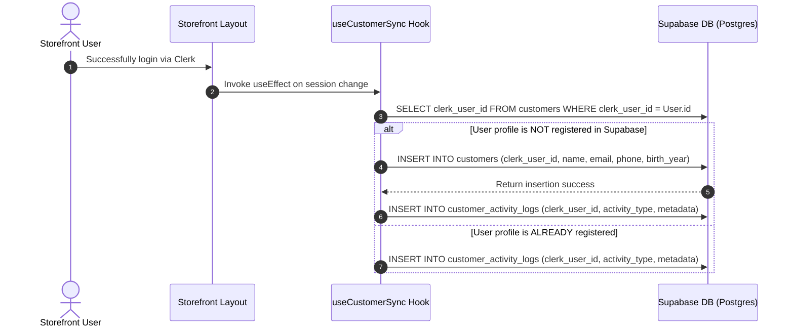

# LUMINA OS: CUSTOMER DATABASE SYSTEM ARCHITECTURE
## CLERK AUTHENTICATION AND SUPABASE RELATIONAL HYBRID SYNC GUIDE

This reference manual documents the hybrid architecture of the **Customer Database** inside Lumina OS. It secures the storefront checkout, tracks buyer engagement metrics, segmentizes age categories dynamically, and synchronizes accounts.

---

## 🗺️ Architectural Topology

Lumina OS utilizes a **decoupled authentication-to-CRM segmentation** pattern. Authentication is managed securely by Clerk, which serves as the identity provider. Database aggregates, segments, purchase frequency, and CRM actions are stored inside Supabase.

```text
       ┌────────────────────────┐
       │     CLERK AUTH SERVICE │
       │  (Source of Identity)  │
       └───────────┬────────────┘
                   │
                   │ (Signed HS256 Token)
                   ▼
┌────────────────────────────────────┐
│      LUMINA FRONTEND CLIENT        │
│    (Next.js App Router Client)     │
└──────────┬───────────────────▲─────┘
           │                   │
           │ (Supabase SQL)    │ (Customer Auto-Sync Loop)
           ▼                   │
┌──────────────────────────────┴─────┐
│      SUPABASE DATABASE MIGRATION   │
│  (Customers Table & Activity Logs) │
└────────────────────────────────────┘
```

---

## 💾 Schema Layout & Relational Constraints

The database manages dynamic segments and activity logging using two main relational schemas:

### 1. `customers` Table
Stores denormalized key metrics to guarantee fast analytics retrieval without taxing PostgreSQL with massive historical orders tables JOIN aggregations.

- **`clerk_user_id`** (`VARCHAR(255) UNIQUE`): Serves as the primary mapping reference between Clerk session headers and Supabase.
- **`birth_year`** (`INTEGER`): Captures customer birth year to evaluate dynamic generation distributions.
- **`total_orders`** (`INTEGER`): Atomic count of total orders processed.
- **`lifetime_value`** (`NUMERIC(12,2)`): Total GMV spending.
- **`last_order_at`** (`TIMESTAMP WITH TIME ZONE`): Latest order date.

### 2. `customer_activity_logs` Table
A high-speed telemetry log that records user checkouts, logins, views, and actions to enable future AI insights.

- **`clerk_user_id`** (`VARCHAR(255) REFERENCES customers(clerk_user_id)`): Ensures strict referential integrity.
- **`activity_type`** (`VARCHAR(100)`): Represents actions such as `'LOGIN'`, `'ORDER_CREATION'`, `'CHECKOUT'`, or `'LOGOUT'`.
- **`metadata`** (`JSONB`): Extensible payload storing details (e.g. IP addresses, product IDs, checkout browsers).

---

## 🔄 Account Synchronization Strategies

Synchronizing identities across isolated services must support local offline development and production environments. Lumina OS defines a dual-stage sync strategy:

### 🚀 1. MVP/Local Strategy: Frontend-Triggered Sync (useCustomerSync)

For development, testing, and staging environments (where a local dev server cannot easily expose a public HTTPS endpoint for receiving Clerk HTTP POST request webhooks), we use a dynamic React Hook:



### 🔒 2. Production Strategy: Server-Side Webhook Sync (Webhook -> API)

For production hardening, customer synchronization is fully migrated to a secure back-channel server webhook, eliminating the need to expose insertion permissions to storefront clients:

```mermaid
graph TD
    A[User Sign-Up in Storefront] --> B[Clerk Creates Auth Instance]
    B -->|Dispatches Webhook POST request| C[Next.js API Route: api/webhooks/clerk]
    C -->|Validate Signature using svix| D[Extract Clerk User Metadata payload]
    D -->|Executes Server-Side Write| E[Supabase Client (Service Role Key Override RLS)]
    E -->|INSERT / UPSERT| F[customers DB Table]
```

#### Production Advantages:
1. **Bulletproof Security**: Front-end clients do not require database insert permissions on profiles.
2. **Reliable Async Queueing**: If a user closes the browser during sign-up, the webhook is retried, ensuring accounts are always synchronized.

---

## 🔒 Security & JWT Claims RLS Architecture

Lumina OS Row Level Security avoids legacy `auth.uid()` parameter checks, protecting tables using uncasted Clerk JWT sub-claims:

```sql
(current_setting('request.jwt.claims', true)::json->>'sub')
```

### whitelisted RLS Directives:
- **Authenticated Users**: Can SELECT and UPDATE their own profile fields where `clerk_user_id` matches the sub claim.
- **Storefront Guests / Newly Registered Users**: Can INSERT records matching their specific authenticated sub claim during `useCustomerSync` initialization.
- **Enterprise Administrators**: Override checks using whitelisted Clerk User IDs (e.g. `user_3DJASQ20EkFYR58471v401LZGTJ`).

---

## 📈 Realtime Denormalized Aggregation Triggers

Denormalized totals (`total_orders`, `lifetime_value`, `last_order_at`) are recalculated atomically in PostgreSQL using an active database trigger. This guarantees high-speed CRM lookup and rendering speeds, completely bypassing performance limits under heavier transaction loads:

```sql
CREATE OR REPLACE FUNCTION update_customer_stats()
RETURNS TRIGGER AS $$
BEGIN
    UPDATE customers
    SET 
        total_orders = (
            SELECT COUNT(*) FROM orders WHERE user_id = NEW.user_id
        ),
        lifetime_value = (
            SELECT COALESCE(SUM(total_amount), 0) FROM orders 
            WHERE user_id = NEW.user_id 
            AND status IN ('pending', 'processing', 'shipped', 'completed')
        ),
        last_order_at = (
            SELECT MAX(created_at) FROM orders WHERE user_id = NEW.user_id
        ),
        updated_at = CURRENT_TIMESTAMP
    WHERE clerk_user_id = NEW.user_id;
    RETURN NEW;
END;
$$ LANGUAGE plpgsql;
```

---

## 🏷️ Dynamic Generation Classifier

Generation cohorts are computed dynamically by sorting birth year boundaries in the frontend and SQL analytics dashboards:

| Generation Cohort | Birth Year Range | CSS Theme (Lumina enterprise) |
| :--- | :--- | :--- |
| **Gen Alpha** | `2011 - 2025` | Emerald Tag (`bg-emerald-50 text-emerald-600`) |
| **Gen Z** | `1995 - 2010` | Violet Tag (`bg-violet-50 text-violet-600`) |
| **Gen Y / Millennial** | `1977 - 1994` | Indigo Tag (`bg-indigo-50 text-indigo-600`) |
| **Gen X** | `1965 - 1976` | Blue Tag (`bg-blue-50 text-blue-600`) |
| **Baby Boomer** | `1946 - 1964` | Orange Tag (`bg-orange-50 text-orange-600`) |
| **Unknown** | Other | Slate Tag (`bg-slate-50 text-slate-500`) |
