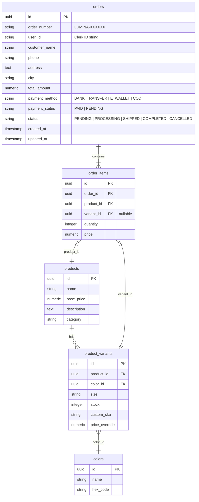
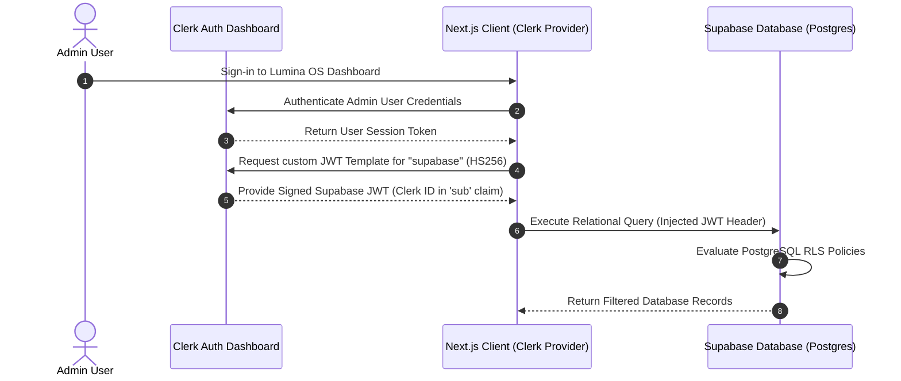
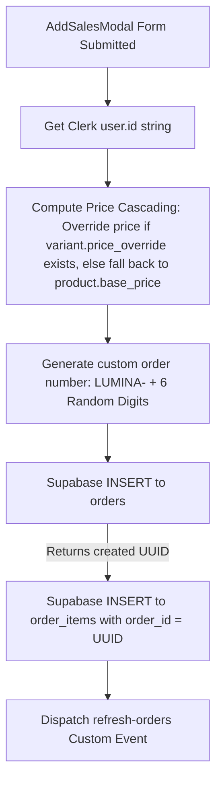
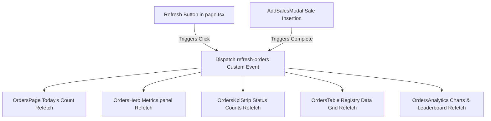

# LUMINA OS E-COMMERCE PLATFORM

## SYSTEM ARCHITECTURE AND SETUP REFERENCE GUIDE

Lumina OS is a premium, high-density enterprise e-commerce storefront and admin order registry system. It leverages a fully decoupled frontend architecture integrated directly with **Clerk Authentication** and **Supabase Database (PostgreSQL)**, featuring real-time data synchronization, customized JWT claims, and bulletproof Row Level Security (RLS) policies.

---

## 🗺️ System Overview & Directory Structure

Lumina OS uses Next.js (App Router), TypeScript, and TailwindCSS for the presentation layer, with Supabase Client SDKs and lightweight window-based custom event hooks facilitating instant real-time decoupling.

### 📂 Directory Structure

```text
Capstone-Project-Pijak-IBM-master
├── docs/                                # DB Schemas, Migrations and SQL Patches
│   ├── orders_schema_migration.sql      # Core orders tables structures & seeds
│   ├── complete_database_rls_policies.sql # Safe JWT claims RLS policies
│   └── fix_clerk_uuid_rls_patch.sql     # Clerk string matching compatibility patch
├── src/
│   ├── app/
│   │   ├── admin/
│   │   │   └── orders/
│   │   │       └── page.tsx             # Main Orders Controller (State & CSV Export)
│   │   ├── components/
│   │   │   └── admin/
│   │   │       └── orders/
│   │   │           ├── AddSalesModal.tsx # Sales transaction relational double-insert
│   │   │           ├── OrdersHero.tsx   # Live Daily Operational KPI Metrics Panel
│   │   │           ├── OrdersKpiStrip.tsx # Live pipeline statuses and daily deltas
│   │   │           ├── OrdersTable.tsx  # Dynamic grid, Search & Advanced Filters
│   │   │           └── OrdersAnalytics.tsx # Dynamic Area Charts, Heatmaps & Leaderboards
│   │   │           └── drawers/
│   │   │               ├── OrderDetailsDrawer.tsx # Relational transactional details drawer
│   │   │               └── OrderActionManager.tsx # Drawer switching coordinator
│   │   ├── hooks/
│   │   │   ├── useSupabaseClient.ts     # Injected Clerk Session JWT Supabase client
│   │   │   └── useFormatCurrency.ts     # IDR/USD Localization formatting helper
│   │   └── store/
│   │       └── languageStore.ts         # Multilingual (ID/EN) global translation hook
```

---

## 🗄️ Database Architecture & Relational Schema

Lumina OS uses an elegant relational database structure inside PostgreSQL to maintain strict relational integrity while offering full flexibility for variable product variants (sizing, custom SKUs, stocks, and color overrides).

### 📊 Relational Database ERD Representation



---

## 🔒 Authentication & Clerk-Supabase JWT Lifecycle

Integrations involving distinct SaaS providers (Clerk for Auth and Supabase for DB) require a standardized JWT claim handshake to avoid security leaks and internal database crashes.

### 🔄 The JWT Handshake Sequence Flow



### ⚠️ The Critical `auth.uid()` UUID Casting Crash

By default, Supabase's built-in `auth.uid()` helper function extracts the active `sub` claim from the incoming JWT and attempts to cast it internally to a PostgreSQL `UUID` type.

Since Clerk User IDs are custom strings (e.g. `'user_3DJASQ20EkFYR58471v401LZGTJ'`), calling `auth.uid()` inside Supabase RLS causes PostgreSQL to crash with a fatal type error:

> `invalid input syntax for type uuid: "user_xxxx"`

#### 💡 The Production Solution

Instead of using `auth.uid()`, we directly read the raw, uncasted JWT `sub` claim as a string using native Postgres config settings. This prevents Postgres type crashes and enables safe, high-speed matching against Clerk user IDs:

```sql
(current_setting('request.jwt.claims', true)::json->>'sub')
```

---

## 📜 Full PostgreSQL RLS Security Policies

Admin security in Lumina OS is strictly whitelist-based. Whitelisted Clerk Admin IDs have complete access to the database, while standard customers are strictly confined to reading/inserting their own orders.

```sql
-- 1. Enable Row Level Security (RLS) on all transaction tables
ALTER TABLE orders ENABLE ROW LEVEL SECURITY;
ALTER TABLE order_items ENABLE ROW LEVEL SECURITY;

-- 2. Drop legacy crashing policies
DROP POLICY IF EXISTS "Users can view their own orders" ON orders;
DROP POLICY IF EXISTS "Users can insert their own orders" ON orders;
DROP POLICY IF EXISTS "Admins have full access to orders" ON orders;
DROP POLICY IF EXISTS "Users can view their own order items" ON order_items;
DROP POLICY IF EXISTS "Users can insert their own order items" ON order_items;
DROP POLICY IF EXISTS "Admins have full access to order_items" ON order_items;

-- 3. Create Clerk compatibility policies for "orders" table
CREATE POLICY "Users can view their own orders"
ON orders FOR SELECT
TO authenticated
USING (
    (current_setting('request.jwt.claims', true)::json->>'sub') = user_id
);

CREATE POLICY "Users can insert their own orders"
ON orders FOR INSERT
TO authenticated
WITH CHECK (
    (current_setting('request.jwt.claims', true)::json->>'sub') = user_id
);

CREATE POLICY "Admins have full access to orders"
ON orders FOR ALL
TO authenticated
USING (
    (current_setting('request.jwt.claims', true)::json->>'sub') IN (
        'user_3DJASQ20EkFYR58471v401LZGTJ', -- Dio Ginting
        'user_3DlVHBqrz0KUR5HLl6brzMw37jN'  -- Dio Abiyyu Zidane Ginting
    )
);

-- 4. Create Clerk compatibility policies for "order_items" table
CREATE POLICY "Users can view their own order items"
ON order_items FOR SELECT
TO authenticated
USING (
    EXISTS (
        SELECT 1 FROM orders
        WHERE orders.id = order_items.order_id
        AND orders.user_id = (current_setting('request.jwt.claims', true)::json->>'sub')
    )
);

CREATE POLICY "Users can insert their own order items"
ON order_items FOR INSERT
TO authenticated
WITH CHECK (
    EXISTS (
        SELECT 1 FROM orders
        WHERE orders.id = order_items.order_id
        AND orders.user_id = (current_setting('request.jwt.claims', true)::json->>'sub')
    )
);

CREATE POLICY "Admins have full access to order_items"
ON order_items FOR ALL
TO authenticated
USING (
    (current_setting('request.jwt.claims', true)::json->>'sub') IN (
        'user_3DJASQ20EkFYR58471v401LZGTJ', -- Dio Ginting
        'user_3DlVHBqrz0KUR5HLl6brzMw37jN'  -- Dio Abiyyu Zidane Ginting
    )
);
```

---

## 📡 Frontend Architecture & Event-Driven Flows

Lumina OS achieves high-density responsiveness through event-driven decoupled components:

### 1. The Sales Input Flow (AddSalesModal)

When an administrator inputs a new storefront/offline sale, a relational transaction is executed:



#### Price Cascading Equation:

$$Price = \text{Coalesce}(\text{Variant Price Override}, \text{Product Base Price}, 0)$$

```typescript
const price = Number(
  selectedVariantObj?.price_override || selectedProductObj?.base_price || 0,
);
```

### 2. Decoupled Custom Event Synchronization Flow

All main orders registry cards, tables, and analytics modules are completely decoupled to prevent duplication and infinite loading states. They communicate via a unified, lightweight event-stream:



### 3. Dynamic CSV Exporter Flow

The CSV Exporter extracts dynamic fields directly from Supabase, formats escape characters, and triggers a client-side blob download:

```typescript
// Query relational structure
const { data } = await supabase.from("orders").select(`
    order_number, customer_name, phone, address, city, payment_status, status, total_amount, created_at,
    order_items (quantity)
  `);

// Build localized headers and escape descriptions
const csv = [
  "Nomor Pesanan,Pelanggan,Telepon,Alamat,Kota,Status Pembayaran,Status Pesanan,Jumlah Item,Subtotal,Tanggal Dibuat",
  ...data.map((o) =>
    [
      o.order_number,
      `"${o.customer_name}"`,
      o.phone,
      `"${o.address}"`,
      `"${o.city}"`,
      o.payment_status.toUpperCase(),
      o.status.toUpperCase(),
      o.order_items.reduce((s, i) => s + i.quantity, 0),
      o.total_amount,
      o.created_at,
    ].join(","),
  ),
].join("\n");
```

### 4. Advanced In-Memory Filtering Algorithm

Lumina OS supports search and advanced filtering over five dimensions. When whitelisted admin properties or date-ranges are updated, the `OrdersTable` immediately performs high-speed in-memory filtering:

```typescript
const filtered = orders.filter((o) => {
  const matchFilter = filter === "ALL" || o.status === filter;
  const matchSearch =
    search === "" ||
    o.id.toLowerCase().includes(search.toLowerCase()) ||
    o.customer.toLowerCase().includes(search.toLowerCase()) ||
    o.city.toLowerCase().includes(search.toLowerCase());
  const matchPayment = paymentFilter === "ALL" || o.payment === paymentFilter;
  const matchCity =
    cityFilter === "" ||
    o.city.toLowerCase().includes(cityFilter.toLowerCase());

  let matchDate = true;
  if (startDate) {
    const start = new Date(startDate);
    start.setHours(0, 0, 0, 0);
    matchDate = matchDate && new Date(o.date) >= start;
  }
  if (endDate) {
    const end = new Date(endDate);
    end.setHours(23, 59, 59, 999);
    matchDate = matchDate && new Date(o.date) <= end;
  }

  return matchFilter && matchSearch && matchPayment && matchCity && matchDate;
});
```

---

## 🛠️ Setup from Scratch & Deployment Guide

Follow these exact steps to deploy Lumina OS to a fresh hosting and database instance.

### 1. Requirements & Setup Checklist

- Node.js version 18.x or 20.x
- Clerk SaaS Account (Clerk Dashboard access)
- Supabase PostgreSQL Database

### 2. Environment Variables Configuration

Create a `.env.local` file at the root of the project:

```bash
# Clerk Configuration
NEXT_PUBLIC_CLERK_PUBLISHABLE_KEY=pk_test_...
CLERK_SECRET_KEY=sk_test_...
NEXT_PUBLIC_CLERK_SIGN_IN_URL=/sign-in
NEXT_PUBLIC_CLERK_SIGN_UP_URL=/sign-up
NEXT_PUBLIC_CLERK_AFTER_SIGN_IN_URL=/admin/orders
NEXT_PUBLIC_CLERK_AFTER_SIGN_UP_URL=/admin/orders

# Supabase Injected Clerk Token Client
NEXT_PUBLIC_SUPABASE_URL=https://your-project-id.supabase.co
NEXT_PUBLIC_SUPABASE_ANON_KEY=eyJhbGciOiJIUzI1NiIsInR5cCI6IkpXVCJ9...
SUPABASE_SERVICE_ROLE_KEY=eyJhbGciOiJIUzI1NiIsInR5cCI6IkpXVCJ9...

# Centralized Role Security Metadata Whitelist
NEXT_PUBLIC_ADMIN_CLERK_IDS="user_3DJASQ20EkFYR58471v401LZGTJ,user_3DlVHBqrz0KUR5HLl6brzMw37jN"
```

### 3. Clerk JWT Template Setup

Lumina OS requires Supabase to securely identify user ID string inputs using JWT verification. Set up the JWT claims inside the Clerk dashboard:

1. Open your **Clerk Dashboard** and navigate to **JWT Templates**.
2. Click **New Template** and select **Supabase**.
3. Set the **Name** to `supabase` (required for Clerk Client SDK lookup).
4. Configure the **Claims** JSON:
   ```json
   {
     "aud": "authenticated",
     "role": "authenticated",
     "sub": "{{user.id}}"
   }
   ```
5. Click **Save**.

### 4. Database Setup

Execute the core schemas inside the **Supabase SQL Editor** in the following order:

1. Run [orders_schema_migration.sql](<file:///d:/Capstone-Project-Pijak-IBM-master%20(barulagi2)/Capstone-Project-Pijak-IBM-master/docs/orders_schema_migration.sql>) to set up tables and seeds.
2. Run [complete_database_rls_policies.sql](<file:///d:/Capstone-Project-Pijak-IBM-master%20(barulagi2)/Capstone-Project-Pijak-IBM-master/docs/complete_database_rls_policies.sql>) to apply PostgreSQL Clerk compatibility security layers.

---

## 🎯 Production Hardening & Security Guidelines

1. **Whitelisted Whitelabeling**: Ensure Clerk Admin Whitelists inside RLS policies match production user IDs strictly before launching public routing.
2. **Disable Schema Mutations**: Set Supabase Schema Access to read-only for anonymous client connections (`anon` key).
3. **No true statements**: Never use `USING (true)` or `WITH CHECK (true)` policies for transaction writes inside database production setups.
4. **JWT Verification Leaks**: Always configure Clerk JWT lifespan to 1 hour to prevent persistent hijacking of client session state tokens.

---

## 🔍 Diagnostics & Troubleshooting Matrix

| Symptom                                                     | Root Cause                                                                                                 | Verified Action Plan                                                                                                                                                                                                                       |
| :---------------------------------------------------------- | :--------------------------------------------------------------------------------------------------------- | :----------------------------------------------------------------------------------------------------------------------------------------------------------------------------------------------------------------------------------------- |
| **"invalid input syntax for type uuid"** on Order Insertion | Calling legacy `auth.uid()` in Supabase RLS. It crashes because Clerk IDs (string) cannot be cast to UUID. | Copy and run [fix_clerk_uuid_rls_patch.sql](<file:///d:/Capstone-Project-Pijak-IBM-master%20(barulagi2)/Capstone-Project-Pijak-IBM-master/docs/fix_clerk_uuid_rls_patch.sql>) to parse custom JWT sub-claims directly as `VARCHAR`/`TEXT`. |
| **"new row violates row-level security policy"**            | Clerk User ID of active session does not match whitelisted array inside target table RLS policies.         | Identify Clerk User ID (e.g. from developer console network logs) and append it to the whitelisted RLS lists inside Supabase.                                                                                                              |
| **Table results display "Gagal mengambil data pesanan"**    | Missing SELECT permission policies on auxiliary `products` or `product_variants` tables.                   | Execute `CREATE POLICY "Enable read for authenticated users" ON products FOR SELECT TO authenticated USING (true);` inside Supabase SQL Editor.                                                                                            |
| **KPI strips and charts display empty zeros**               | Event listeners or listeners binding was disconnected or suffered stale closures during rerendering.       | Ensure `window.addEventListener` uses clean unmount closures (`return () => window.removeEventListener...`) inside `useEffect`.                                                                                                            |
